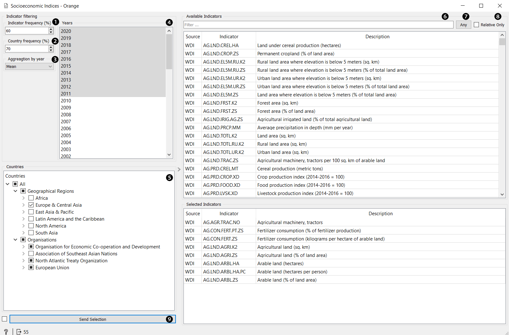

Socioeconomic Indices
=====================

Downloads socioeconomic data from remote Mongo database.

**Outputs**:

- Data: Dataset containing filtered selected socioeconomic data.

The **Socioeconomic Indices** widget enables downloading of social and economic indicators from
a remote mongo database filled from various economic databases such as [WHR](https://worldhappiness.report/), 
[WDI](https://data.worldbank.org/), [OECD](https://stats.oecd.org/).

1. Select the percentage of non-missing values to keep indicator.
2. Select the percentage of non-missing values to keep country.
3. Select method for aggregation of indicator data by year.
4. Select list of years.
5. Check countries in regions or organizations.
6. Search available socioeconomic indicators.
7. Choose if search must include all or any keyword. Keywords are separated by spaces.
8. Check to filter only relative indicators.
9. Retrieve data from remote database based on current selection.

You can drag and drop indicators between **Available Indicators** and **Selected Indicators**.
To delete **Selected Indicators** you can use delete or drag them back to **Available Indicators**.